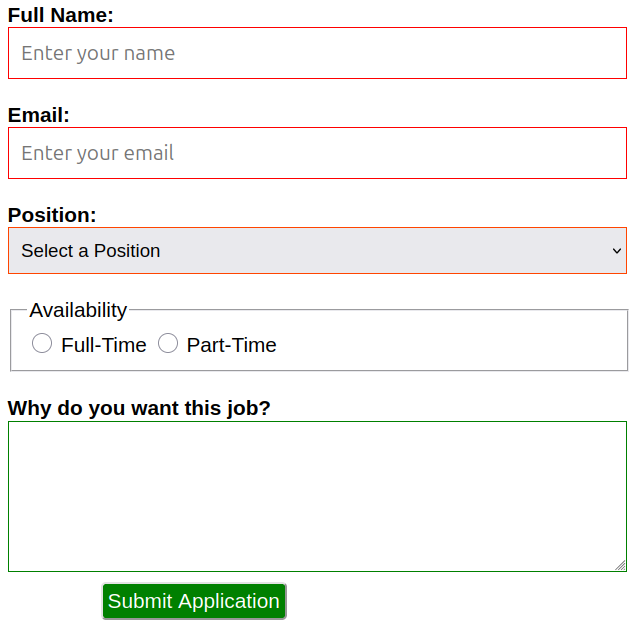

# 💼 Job Application Form

A responsive and user-friendly job application form built using **HTML** and **CSS**. This form allows users to input their personal details, select a desired job position, indicate availability, and provide a motivation statement.

---

## 📁 Project Structure

```
job-application-form/
│
├── index.html              # Main HTML structure
├── styles.css              # Styling rules for the form
├── images/
│   └── preview.png         # Screenshot preview of the form
└── README.md               # This documentation file
```

---

## 📷 Preview



> _This is a preview of how the form looks in the browser._

---

## 🌟 Features

- **Responsive Layout** — Adaptable for different screen sizes
- **Form Validation** — Highlights valid (green) and invalid (red) fields
- **Focus Styling** — Highlights inputs when focused (orangered border)
- **Custom Radio Buttons** — Green color and larger clickable area
- **Accessible Labels** — Each input is associated with a clear label
- **Motivation Section** — Textarea for explaining interest in the job
- **Styled Submit Button** — Visually appealing and hover effects

---

## 🖥️ How to Run

To view the form in your browser:

1. Clone or download this repository:
   ```bash
   git clone https://github.com/your-username/job-application-form.git
   ```

2. Navigate into the project directory:
   ```bash
   cd job-application-form
   ```

3. Open the `index.html` file with your browser:
   - On most systems, you can just double-click the file
   - Or use:
     ```bash
     open index.html     # macOS
     xdg-open index.html # Linux
     start index.html    # Windows
     ```

---

## 🔧 To-Do / Enhancements

- Add JavaScript-based form validation
- Connect the form to a backend for submission
- Improve accessibility using ARIA roles
- Include confirmation messages upon submission
- Add mobile-first design improvements

---

## 🛠️ Built With

- HTML5
- CSS3 (vanilla)

---

## 📄 License

This project is licensed under the **MIT License** — you are free to use, copy, modify, and distribute it.

---

## 🤝 Contributing

Contributions are welcome! Feel free to fork this repo and submit pull requests with improvements or features.

---

## 🙋 Author

**josephkarianjahinjeri**  
[LinkedIn](https://www.linkedin.com) | [GitHub](https://github.com)

---
